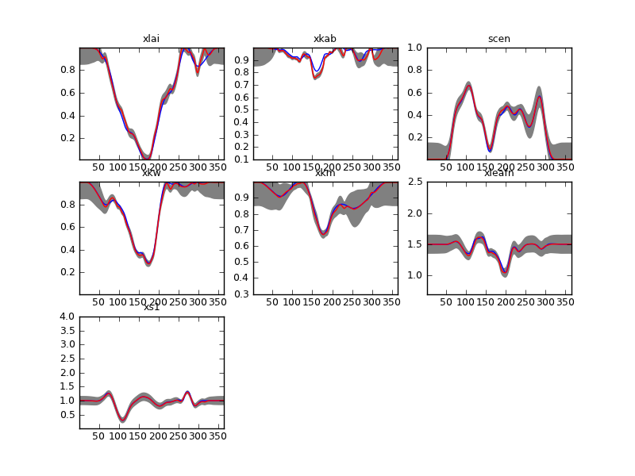

***************************************************************************
Inverting a time series of MODIS observations over agricultural fields
***************************************************************************

Introduction
^^^^^^^^^^^^^^^^

The current example builds on the previous synthetic example by using
data from the MODIS sensor on the TERRA and AQUA platforms to invert
the state of the land surface over an agricultural area in Thuringia
(Germany). We shall use a script similar to `sentinel.py <https://github.com/jgomezdans/eoldas_release/blob/master/sentinel.py>`_
but will use a slightly different inversion strategy. The data are in
the file `brdf_WW_1_A_1.kernelFiltered.dat <https://github.com/jgomezdans/eoldas_release/blob/master/data/brdf_WW_1_A_1.kernelFiltered.dat>`_

The solution strategy tries to overcome one of the weaknesses of the
system so far: the need for very costly cross-validation in order
to estimate the hyperparameters. This is done by using the single
observation estimates (assuming that they are a reasonable approximation
to the true estate) to initialise the EOLDAS inversion. Since the single
observation estimates are usually gappy, we interpolated them smoothly
using the regularisation method introduced in `Garcia (2010) <http://www.biomecardio.com/pageshtm/publi/csda10.pdf>`_
This step is effectively a fast equivalent of the smoothing of NDVI
time series, that includes generalised cross validation. This results
in smooth time series of parameters, as well as estimates of the 
regularisation hyperparameter (for each of the components of the state
vector). Starting the final EOLDAS inversion from here, using a value
of the hyperparameter derived from the smoothing puts the cost function
minimiser close to the minimum, so fewer iterations are needed to solve
the problem.

The script
^^^^^^^^^^^^

The script is quite simple, and uses the ``Sentinel`` class from the 
Sentinel synthetic experiment. The code is stored in a function 
called ``main``:

.. literalinclude:: ../modis_inversions.py
   :language: python
   :pyobject: main   

The structure of the code will be familiar from the sentinel experiment:
the only novelty is the use of the ``Sentinel.smooth`` method to perform
the smoothing of the parameters. Instead of starting from the prior or
from the true data, as we did in the synthetic experiment, we use the 
``initial`` keyword to feed the smoothed interpolated estimates. 
We can see that the result of the single observation inversions are
very noisy and with large uncertainties (file ``plots/testFieldDataSingle.png``):

.. figure:: testFieldDataSingle.png 
   :width: 80%
   
   Results inverting each observation individually for a wheat field. 
   Note that this plot is in transformed coordinates
   
The parameter-by-parameter smoothing using the method of `Garcia (2010) <http://www.biomecardio.com/pageshtm/publi/csda10.pdf>`_
results in a smoothed and complete version of the parameter evolution.
We can see that this is already a fairly good estimate of the parameters.
(the plot is in ``plots/output/brdf_WW_1_A_1.kernelFilteredSingle.dat_smooth.png``)

.. figure:: brdf_WW_1_A_1.kernelFilteredSingle.dat_smooth.png
   :width: 80%
      
   Parameter-by-parameter smoothing and interpolation. The red line
   shows the maximum a posteriori paremeter estimate, and the grey
   lines show a measure of the uncertainty. The blue line show the 
   temporal evolution of the Sentinel synthetic experiment trajectories
   for comparison. Note that this plot is in transformed coordinates
 
Using this a starting value, we then solve the EOLDAS problem. We expect
that this solution is already close the minimum, so solving the problem
will be reasonably fast. We also use the :math:`\Gamma` from the optimal
smoothing/interpolation. While this is not exactly the same problem that
we are solving in EOLDAS (different boundary conditions and limited
to a second order differntial operator), we assume that there's tolerance
to :math:`\Gamma` (see Lewis et al 2012). The results confirm that we
only tweak the starting solution slightly: the red line (with associated
grey 95% CI) is very similar in most cases to the initial value (blue line). 
The plot is in ``plots/output/brdf_WW_1_A_1.kernelFiltered.dat_Gamma00000529.png``:

      
  DA solution in red (plus grey 95% credible interval). The blue line
  shows the initial guess. Note that this plot is in transformed coordinates.
  
.. figure:: brdf_WW_1_A_1.kernelFiltered.dat_result.dat.plot.x.png
   :width: 80%
           
   DA solution in red (plus grey 95% credible interval) in real 
   coordinates . This plot can be found in 
   ``output/brdf_WW_1_A_1.kernelFiltered.dat_result.dat.plot.x.png``
                  

    
The temporal evolution shown in this las plot is consistent with the
development of a wheat field, and even senescence and leaf water 
dynamics can arguably be identified after the peak LAI period.

Some comments
^^^^^^^^^^^^^^^

This is nearly equivalent for solving for the dynamic model term. Since
the solution is already quite close to the minimum, only slight 
modifications in the observation component are envisaged. Further
speed-ups can be envisaged by using a linear approximation to the
observation operator at this stage. Also, in a practical sense, the
single inversions don't uncertainty calculations, and a faster first
pass using look-up tables might add further speed to the whole process.
